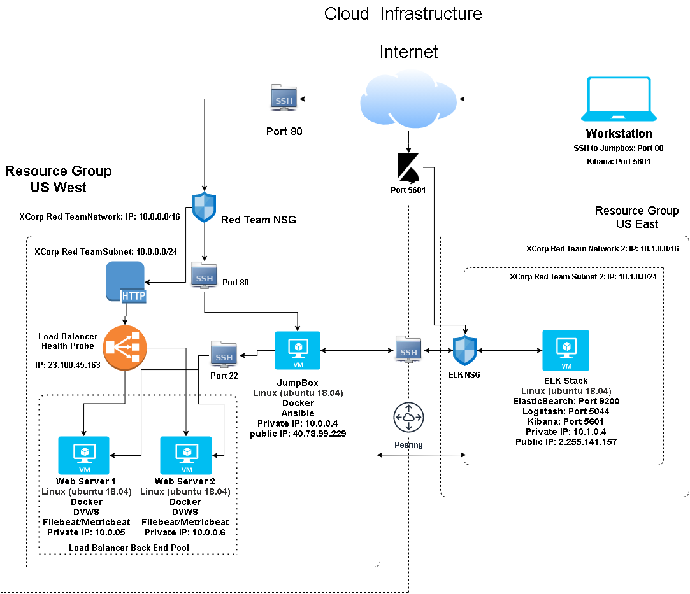
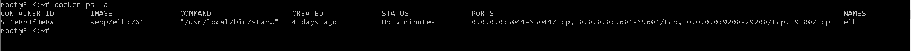

## Automated ELK Stack Deployment

The files in this repository were used to configure the network depicted below.

These files have been tested and used to generate a live ELK deployment on Azure. They can be used to either recreate the entire deployment pictured above. Alternatively, select portions of the playbook file may be used to install only certain pieces of it, such as Filebeat.

Resources
Playbook Files

- _[Elk Playbook File](Ansible/elk.yml)_
- _[DVWA Playbook File](Ansible/dvwa.yml)_
- _[Filebeat Playbook File](Ansible/filebeat.yml)_
- _[Metricbeat Playbook File](Ansible/metricbeat.yml)_

This document contains the following details:
- Description of the Topology
- Access Policies
- ELK Configuration
  - Beats in Use
  - Machines Being Monitored
- How to Use the Ansible Build

### Description of the Topology

The main purpose of this network is to expose a load-balanced and monitored instance of DVWA, the D*mn Vulnerable Web Application.

Load balancing ensures that the application will be highly available and reliable, in addition to restricting hackers and unwanted traffic to the network.
- Load Balancers offer additional levels of security to your web applications via a Web Application Firewall, as well as protecting against DDoS attacks by distributing requests equally to each server. Further, health probes ensure that if a response is not received by a server in the Load Balancers back end pool that no further traffic will be sent to that server, as it will assume the server is dead._

Integrating an ELK server allows users to easily monitor the vulnerable VMs for changes to the logs and system traffic.
- _Filebeat watches for log events and is used to monitor log files and forward to logstash for indexing_
- _Metricbeat watches for metrics from the operating system, containers and services running on the servers_

The configuration details of each machine may be found below.

| Name          | Function    | IP Address                               |   Operating System   |
|---------------|-------------|------------------------------------------|----------------------|
| Jump Box      | Gateway     | Private: 10.0.0.4 Public: 40.78.99.229   | Linux (Ubuntu 18.04) |
| Web Server 1  | Application | 10.0.0.5                                 | Linux (Ubuntu 18.04) |
| Web Server 2  | Application | 10.0.0.6                                 | Linux (Ubuntu 18.04) |
| ELK Server    | Logs        | Private: 10.1.0.4 Public: 52.255.141.157 | Linux (Ubuntu 18.04) |

### Access Policies

The machines on the internal network are not exposed to the public Internet except for the Jumpbox and web application interfaces. 

Only the Jumpbox machine accept connections from the Internet. Access to this machines is only allowed from the following IP address:
- _135.23.84.40_

The Load Balancer can accept HTTP connection via port 80 in order to access the DVWA web Interface.
The ELK Stack can accept HTTP connection via port 5601 in order to access the Kibana web Interface.

HTTP access to these machines are only allowed from the following IP address:
- _135.23.84.40_

Machines within the network can only be accessed by the ansible container on the Jumpbox.
- _Internal access to my ELK VM can only be obtained by my Jumpbox; IP:10.0.0.4, External access to my ELK VM's Kibana interface can only be obtained on port 5601 by my local machine; IP: 135.23.84.40_

A summary of the access policies in place can be found in the table below.

| Name          | Publicly Accessible | Allowed IP Addresses       |
|---------------|---------------------|----------------------------|
| Jump Box      | Yes                 | 135.23.84.40               |
| Load Balancer | Yes                 | 135.23.84.40               |
| ELK Server    | Yes                 | 10.0.0.4 135.23.84.40:5601 |  
| Web Server 1  | No                  | 10.0.0.4                   |
| Web Server 2  | No                  | 10.0.0.4                   |

### Elk Configuration

Ansible was used to automate configuration of the ELK machine. No configuration was performed manually, which is advantageous because it allows for Continuous Integration/Deployment. Infrastructure as Code allows IT administrators to push configuration files to new machines or networks and conintuously update machines, containers, and networks when there are any updates to the configuration files. This allows for more time to focus on more important tasks that may deliver more value to the organization. 

The playbook implements the following tasks:
- Install Docker.io
- Install Python pip3
- Install Docker module
- Increase virtual memory
- Install Elk container

The following screenshot displays the result of running `docker ps` after successfully configuring the ELK instance.

### Target Machines & Beats
This ELK server is configured to monitor the following machines:
- _Web Server 1; IP: 10.0.0.5_
- _Web Server 2; IP: 10.0.0.6_

We have installed the following Beats on these machines:
- _Filebeat and Metricbeat_

These Beats allow us to collect the following information from each machine:
- _Filebeats monitors log files or specified locations in order to collect log events. Logs can include system logs, SSH login logs, Sudo command logs etc._ 
- _Metricbeats collects metrics from the Operating System and services running on the servers. This includes CPU usage, memory usage, total numbers of containers/dockers etc._

### Using the Playbook
In order to use the playbook, you will need to have an Ansible control node already configured. Assuming you have such a control node provisioned: 

SSH into the control node and follow the steps below:
- Copy the _____ file to _____.
- Update the _____ file to include...
- Run the playbook, and navigate to ____ to check that the installation worked as expected.

_TODO: Answer the following questions to fill in the blanks:_
- _Which file is the playbook? Where do you copy it?_
- _Which file do you update to make Ansible run the playbook on a specific machine? How do I specify which machine to install the ELK server on versus which to install Filebeat on?_
- _Which URL do you navigate to in order to check that the ELK server is running?

_As a **Bonus**, provide the specific commands the user will need to run to download the playbook, update the files, etc._